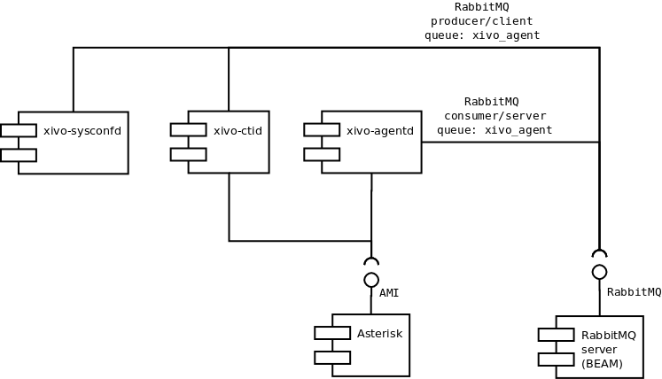
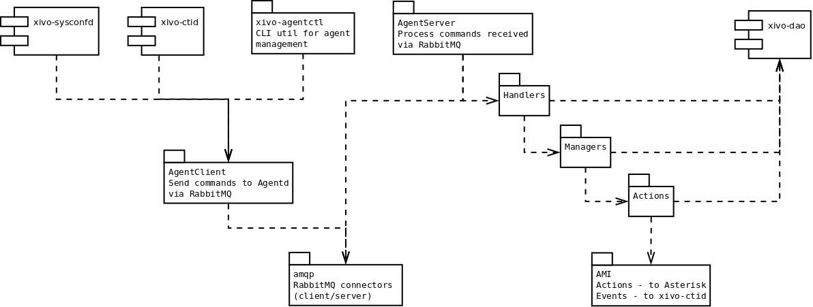

Design of xivo-agentd
#####################

Component's role
****************

The aim of this component is agent management. Following actions are implemented:

 * Add agent to queue
 * Exit the interpreter
 * Display help about commands
 * Login agent
 * Logoff agent
 * Pause agent
 * Ping server
 * Relog all currently logged agents
 * Remove agent from queue
 * Get status of agent
 * Unpause agent

.. note:: This list can may change. A list of implemented commands is given 
			 by the ``xivo-agentctl`` utility.

Component's interfaces
**********************

The following figure shows main interfaces of xivo-agentd module. This module is connected to Asterisk
AMI interface for queues' management and provides its services via RabbitMQ Direct Exchange using queue
named ``xivo_agent``.

Component's architecture from 10,000 feet
*****************************************

Code of xivo-agentd implements RabbitMQ producer and consumer for the direct exchange queue named
``xivo_agent``. The client side implementation can be integrated by other components for agent
management (it's used i.g. by xivo-ctid). Commands are executed as RPC.

.. note:: Show dependencies are dynamics, dependency injection is used in the code.

