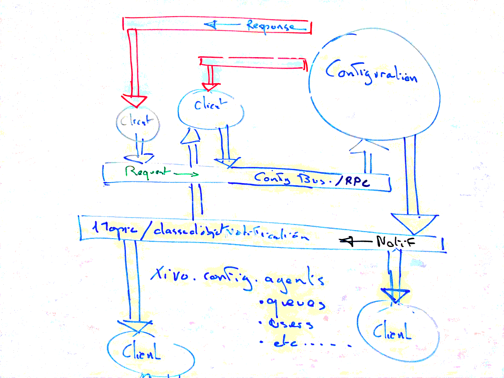

Design of XiVO Configuration server
###################################

Component's role
****************

The aim of this component is to provide an unique configuration service. This service is addressed via a
software bus. It processes configuration requests and publish corresponding notifications on a software
bus. These notifications are classed by topics. Each component can intercept only topics of its
interest. We're using RabbitMQ_ as XiVO message bus.

.. _RabbitMQ: http://http://www.rabbitmq.com/

Component's interfaces
**********************

The following figure shows main interfaces of XiVO configuration server. This component is connected to
XiVO's databases and accepts configuration commands via RabbitMQ_ Direct Exchange using queue named
``xivo_configuration`` in RPC mode. Notification of configuration updates are published using RabbitMQ_
Topic Exchange.

.. note:: Configuration databases are not shown in the figure above.

