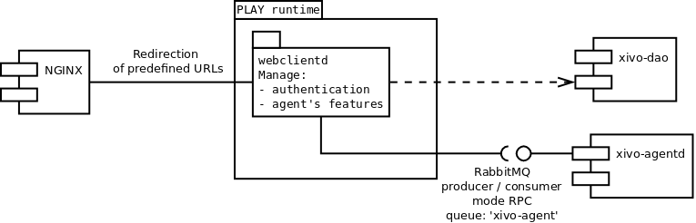

Design of xivo-webclientd
#########################

Component's role
****************

The aim of this component is interfacing of web based CTI clients. This component is currently in
development and implementation of following actions is in progress:

 * Authentication
 * Login agent
 * Logoff agent
 * Pause agent
 * Get status of agent
 * Unpause agent

.. note:: This list can may change.

Component's architecture from 10,000 feet
*****************************************

This component is using Play_ framework. Play framework based application verify user's credentials in
the configuration database via DAO component. The Direct Exchange queue ``xivo_agent`` is used in RPC
mode for agent's features management.

.. _Play: http://www.playframework.com/

